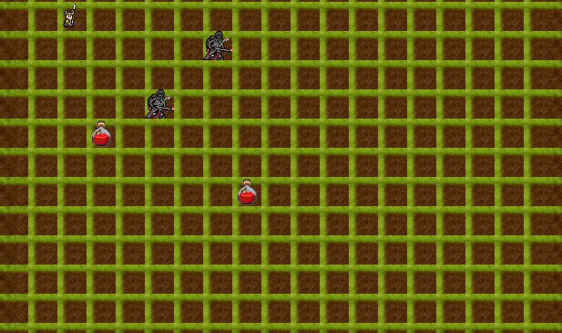

# 🎮 Dungeon Crawler – Пошаговая RPG с паттернами проектирования


Учебный проект по курсу «Паттерны проектирования». Представляет собой простую пошаговую игру в жанре roguelike, где герой исследует подземелье, сражается с монстрами и собирает зелья.

**Особенности:**
- Консольная и графическая (SFML) версии в одном коде.
- Применение шести паттернов проектирования.
- Тайловая карта, спрайты, полоска здоровья, события.
- Кроссплатформенная сборка через CMake.



## 📚 Реализованные паттерны проектирования

| Паттерн | Где применяется | Зачем |
|---------|-----------------|-------|
| **Абстрактная фабрика** | `UnitFactory`, `HeroSpriteFactory`, `EnemySpriteFactory` | Создание юнитов без привязки к конкретным классам |
| **Стратегия** | `IBehaviorStrategy`, `AggressiveStrategy`, `DefensiveStrategy` | Изменяемое поведение врагов (агрессивное, защитное) |
| **Наблюдатель** | `IObserver`, `ConsoleObserver`, `GameManager::notify` | Оповещение о событиях (вывод в консоль / на экран) |
| **Одиночка** | `GameManager` | Глобальный доступ к игровому циклу и состоянию |
| **Состояние** | `IUnitState`, `IdleState`, `MovingState`, `AttackingState` | Управление состояниями юнита (ожидание, движение, атака) |
| **Команда** | `Command`, `MoveCommand`, `AttackCommand` | Инкапсуляция действий с возможностью отмены |  
>⚠️ Некоторые паттерны добавлены в учебных целях для демонстрации архитектурных подходов.  


## 🕹️ Управление

- **W / A / S / D** – перемещение героя / атака врага / подбор зелья
- **Q** – выход из игры

## 🔧 Сборка и запуск

### Требования
- Компилятор с поддержкой C++17 (GCC, Clang, MSVC)
- [CMake](https://cmake.org/) 3.10+
- [SFML 3.0](https://www.sfml-dev.org/download/sfml/3.0.2/)

### Инструкция (Windows / Linux / macOS)

1. Клонируйте репозиторий:
   ```bash
   git clone https://github.com/bankhaev01-coder/dungeon-crawler.git
    cd dungeon-crawler
	```  
2. Укажите путь к SFML в CMakeLists.txt (или передайте через -DSFML_DIR при конфигурации):
  	```cmake
  	set(SFML_DIR "C:/path/to/SFML-3.0.2/lib/cmake/SFML")
     ```
3. Соберите проект:
	 ```bash
	 mkdir build
	 cd build
	 cmake ..
	 cmake --build .
     ```
 4. Поместите ресурсы (папка assets) рядом с исполняемым файлом или в корень проекта (CMake скопирует их автоматически).
   5. Запустите игру:
     	```bash
      	./dungeon
     	```
   ## 📂Структура проекта
  >.  
  >├── CMakeLists.txt  
  >├── main.cpp  
  >├── include/          # Заголовочные файлы  
  >├── src/              # Реализация  
  >└── assets/           # Ресурсы (изображения, шрифты)  

## 🧠 Чему можно научиться
* Проектированию гибкой архитектуры с использованием паттернов.
* Разделению логики и представления (MVC-подобный подход).  
* Интеграции сторонней библиотеки (SFML) в существующий код.
* Работе с тайловой графикой и системой координат.
* Использованию CMake для кроссплатформенной сборки.

## 🚀 Что можно улучшить
* Генерация уровней
* Улучшение AI врагов
* Система инвентаря
* Звуки и эффекты
* Удаление избыточных паттернов (оптимизация архитектуры)

## 🎯 Цель проекта

### Проект был разработан для:

* практики современного C++
* изучения паттернов проектирования
* создания портфолио для junior позиции

## КОНТАКТЫ И ПОДДЕРЖКА
Автор: Аушев Муслим  
GitHub Issues: https://github.com/bankhaev01-coder/dungeon-crawler/issues  
Mail: bankhaev01@gmail.com

При возникновении вопросов создавайте issue в репозитории.
